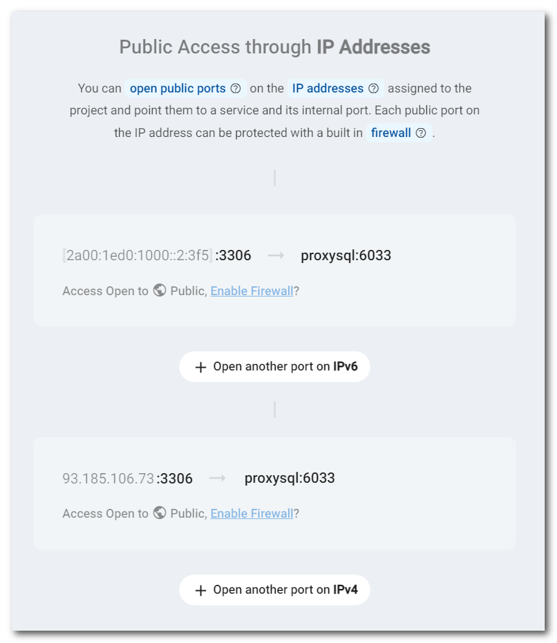
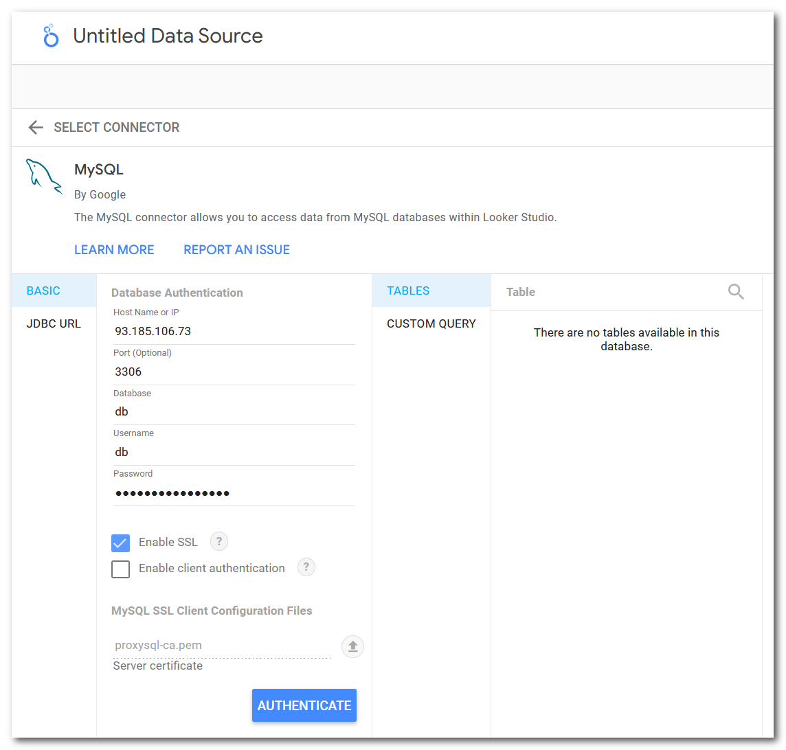

# ProxyDB Zerops's recipe

Demonstration of using ProxySQL to access MariaDB in Zerops.

## Basic facts

* ProxyDB is set to require SSL connections only.

* To access ProxyDB from outside the Internet, it's necessary to set the public access through IPv4 or IPv6 addresses for the `proxysql:6033` port. See the example below.



* To access the MariaDB database form Google DataStudio fill in the connection form. Because of the SSL connection, you have to attach `proxy-ca.pem` certificate from the ProxySQL instance. You can find it in the ProxySQL data directory `/var/lib/proxysql/`.



* The ProxySQL configuration is created through `zerops.yml` build pipe YAML and the `proxysql-cnf.sh` script.

* You have to fill in a new password for admin access to the ProxySQL server before you run the import script. See the environment variable **PROXYSQL_PASSWORD** in the import script below. This manual step won't be necessary with a new Zerops feature called `Import Script Functions` that will be released in several next days.

## Zerops import script to instantiate the demonstration

```yml
project:
  name: ProxySqlAccess
services:
  - hostname: db
    type: mariadb@10.4
    mode: NON_HA
    priority: 1
  - hostname: proxysql
    type: nodejs@16
    envVariables:
      PROXYSQL_DATABASE_HOSTNAME: ${db_hostname}
      PROXYSQL_DATABASE_PASSWORD: ${db_password}
      PROXYSQL_DATABASE_USER: ${db_user}
      PROXYSQL_LOGIN: proxysql
      PROXYSQL_PASSWORD: <chosen password>
    ports:
      - port: 6032
      - port: 6033
      - port: 3000
        httpSupport: true
    minContainers: 1
    maxContainers: 1
    buildFromGit: https://github.com/zeropsio/recipe-proxydb@main
```
